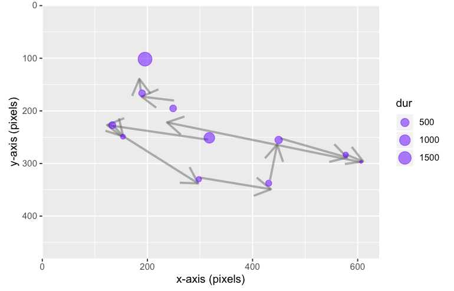

# eyelinker

<!-- badges: start -->
[](https://CRAN.R-project.org/package=eyelinker)
[](https://github.com/a-hurst/eyelinker/actions)
[](https://app.codecov.io/gh/a-hurst/eyelinker)
[](https://lifecycle.r-lib.org/articles/stages.html#stable)
<!-- badges: end -->

An R package for importing plain-text ASC data files from EyeLink eye trackers into (relatively) well-structured data frames. EDF files first must be converted to ASC using the `edf2asc` tool before they can be imported.



Great efforts have been made to make this package fast, stable, and highly compatible. If you encounter any problems using eyelinker (or would like to make a feature request), please open an issue on the project's GitHub page.

**NOTE**: As of version 0.2.0, eyelinker has been rewritten almost entirely for greater stability and speed. Please refer to the `NEWS` file for a comprehensive list of changes and improvements.

## Installation

```r
# Install the latest release from CRAN:
install.packages("eyelinker")

# Install the latest development version from GitHub:
require(devtools)
devtools::install_github("a-hurst/eyelinker")
```

## Usage

```r
library(eyelinker)

# Example file from SR research that ships with the package
fpath <- system.file("extdata/mono500.asc.gz", package = "eyelinker")
dat <- read_asc(fpath)
plot(dat$raw$time, dat$raw$xp, xlab = "Time (ms)", ylab = "Eye position along x-axis (px)")

# For more info:
vignette("basics", package = "eyelinker")
```

## Credits

* Author: Simon Barthelmé, CNRS, Gipsa-lab
* Maintainer: Austin Hurst, Dalhousie University
